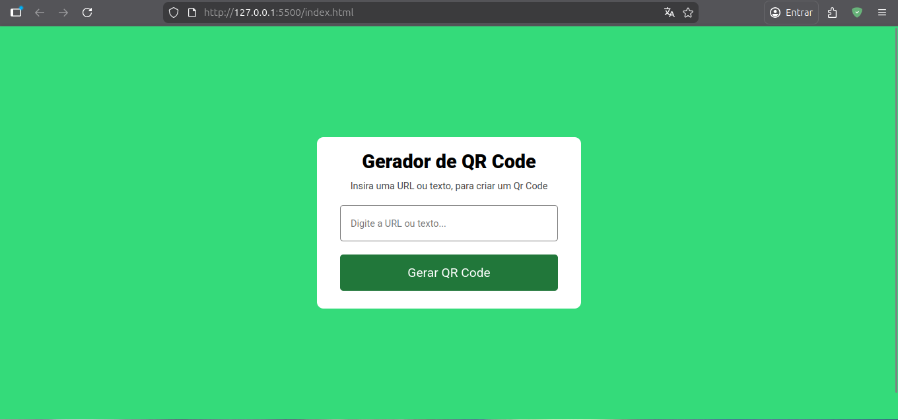
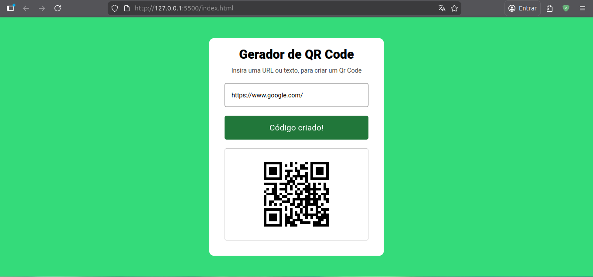

# QR Code Generator

A simple and elegant web application that generates QR codes from URLs or text using the QR Server API.

## Technologies Used

- **HTML5**: Semantic structure.
- **CSS3**: Modern styling and glassmorphism effects.
- **JavaScript (ES6)**: DOM manipulation and API integration.
- **Google Fonts**: Roboto font family.
- **[QR Server API](https://goqr.me/api/)**: To generate the QR Code images.

## 📂 Project Structure

```text
.
├── assets
│   ├── css
│   │   └── styles.css
│   ├── img
│   │   └── qrcode.png
│   └── js
│       └── scripts.js
├── index.html
└── README.md
```

## 🛠️ How to Run

### Without Live Server

1. Clone or download the repository.
2. Navigate to the project folder.
3. Open the `index.html` file directly in your preferred web browser (Chrome, Firefox, Edge, etc.).

### With Live Server (VS Code Extension)

1. Open the project folder in **Visual Studio Code**.
2. Install the **Live Server** extension (if you haven't already).
3. Right-click on `index.html` and select **"Open with Live Server"**.
4. The project will automatically open in your default browser at `http://127.0.0.1:5500`.

## 📷 Previews



